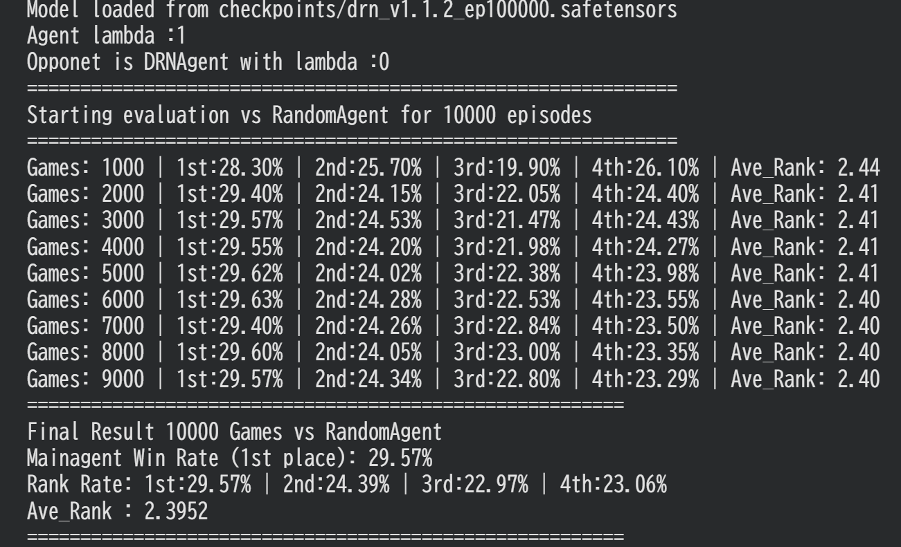
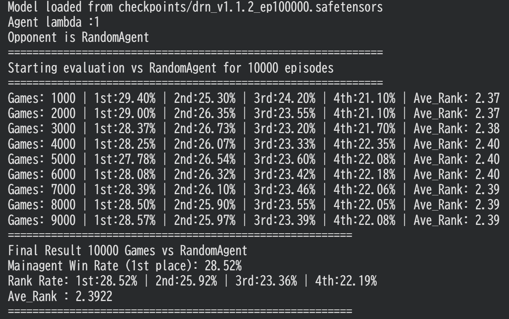

# DRN (Deep Regret Network) concept 

DRNは、通常のQ学習に後悔値（Regret）の概念を組み合わせ、効率的な探索と行動選択を行うための深層強化学習手法の実装案です。

（まだ検証段階です）

---

## 💡 実装の3ステップ

### Step 1: Q値の事前学習
通常のDQN（Deep Q-Network）を用いて、Q値をある程度予測できるように学習させます。

### Step 2: 後悔値（Regret）のブートストラップ予測
Step 1で得られたQ値ベースのターゲットを利用し、DRN（Deep Regret Network）で後悔値をブートストラップ方式により予測させます。

### Step 3: 後悔値に基づく行動選択
学習したQ値と後悔値を組み合わせた評価値をもとに、確率的な行動選択を行います。

---

## 📐 損失関数 (Loss Function) の定義

### 1. Step 1 の Loss (DQN)
ターゲットQ値 $target_Q$ およびQネットワークの損失関数 $loss_Q$ は以下の通りです。Huber損失（デルタ=1.0）を使用します。

$$target_Q = r + \gamma \max_{a'} Q(s', a')$$

$$loss_Q = \text{Huber}(Q(s, a), target_Q, 1.0)$$

### 2. Step 2 の Loss (DRN)
ターゲット後悔値 $target_R$ および後悔値ネットワークの損失関数 $loss_R$ は以下の通りです。

$$target_R = \left( \max_{a} Q_{\text{target}}(s, a) - Q_{\text{target}}(s, a) \right) + \gamma \min_{a'} \max(0, R(s', a'))$$

$$loss_R = \text{Huber}(R(s, a), target_R, 1.0)$$

---

## 🎮 Step 3: 行動選択の方針

行動の評価値 $M(s, a)$ をQ値と後悔値の線形結合で定義し、ソフトマックス関数を用いて行動確率 $\pi(a|s)$ を算出します。また、非合法手を排除するためのマスク処理（ $I_{\text{legal}}(s, a)$ ）を導入します。

### 1. 評価値 $M(s, a)$ の計算
$$\begin{aligned}
M(s, a) &= (1 - \lambda) Q(s, a) - \lambda R(s, a) \\
I_{\text{legal}}(s, a) &= \begin{cases} 0 & \text{if } a \in A_{\text{legal}}(s)  \\  
-\infty & \text{if } a \notin A_{\text{legal}}(s) \end{cases} \\
M(s, a) &= M(s, a) + I_{\text{legal}}(s, a)
\end{aligned}$$

### 2. 行動選択確率 $\pi(a|s)$ の算出
評価値 $M(s, a)$ と温度パラメータ $T$ を用いたボルツマン分布（ソフトマックス関数）により確率を決定します。

$$\pi(a|s) = \frac{\exp\left(\frac{M(s, a)}{T}\right)}{\sum_{a' \in A} \exp\left(\frac{M(s, a')}{T}\right)}$$

---

## 🛠️ 合法手・非合法手の数理的挙動

上記のマスク処理により、実際の行動選択確率は以下のように厳密に制御されます。

* **行動 $a$ が合法手（ $a \in A_{\text{legal}}(s)$ ）の場合：**
  $I_{\text{legal}}(s, a) = 0$ となり、分母の非合法手の項は $\exp(-\infty) = 0$
  となるため、数理的に以下の確率が導出されます。

  $$\pi(a|s) = \frac{\exp\left(\frac{(1 - \lambda)Q(s, a) - \lambda R(s, a)}{T}\right)}{\sum_{a'' \in A_{\text{legal}}(s)} \exp\left(\frac{(1 - \lambda)Q(s, a'') - \lambda R(s, a'')}{T}\right)}$$

* **行動 $a$ が非合法手（ $a \notin A_{\text{legal}}(s)$ ）の場合：**
  分子が $\exp(-\infty) = 0$ となるため、確率は厳密にゼロになります。
  
   $$\pi(a|s) = 0$$

エージェントは、上記で得られた確率分布 $\pi(a|s)$ に従って、実際の行動 $a$ を確率的な選択で決定します。これにより、**後悔値の小さい（探索の価値がある）合法手のみが選ばれやすくなります。**

λを減衰させることでQ値のベースラインを消すことができる。actor-critic等の方策ベースではモデル容量が大きくなってしまう課題があったが、このアルゴリズムだと学習モデルの推論時にはDQN側は必要ない為、モデル容量を50%削減することができる。また、オフポリシーでの学習ができるため、サンプル効率も良くなり、平均戦略の近似も容易になると考えられる。

## 7並べにおける結果

>図1:DQNモデル(ランダム相手に平均着順2.2)3体相手の結果

>図2:ランダム3体相手の結果

~~実験ログから、相手の戦略に関わらず平均着順2.4を維持していることがわかる。~~

~~相手の戦略にかかわらず、自分が損しない戦略を選ぶことができており、ナッシュ均衡の近似ができていると考えらえる。~~

 **※修正:コードの一行が間違っており、このログは常に相手がランダムとなっておりました。修正後確認すると、平均着順2.6になりました。**
 **データの前提条件にミスがあったことを深くお詫び申し上げます。現在は、DRNの数理ロジックそのものの有効性を厳密に切り分けるため、よりシンプルな検証環境（Gridworld）へスケールダウンした検証と、アルゴリズムの改善策をリアルタイムで模索・実行中です。(2026年7月12日)**

具体的なコードはこちらからご覧ください。src/agent/drn_agent.rsに更新方法やaction選択があります。
https://github.com/oyoyo4556/Sevens_Rust_RL

